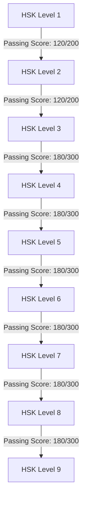

  

<h1 align="center">
Hanzi Lanterns
<ruby>
  漢<rt>hàn</rt>
  字<rt>zì</rt>
  燈<rt>dēng</rt>
  籠<rt>lóng</rt>
</ruby>

</h1>

Hanzi Lanterns is a blog about Chinese culture, characters and history.

This blog is not operated by a team, but rather a single person.

I try my best to take my information from reliable resources, such as [Chineasy](https://www.chineasy.com) and the [corresponding books](https://www.harpercollins.com/blogs/authors/shaolan-20162122537947).

## Acknowledgment

**This theme was inspired by [Astro Theme Cactus](https://github.com/chrismwilliams/astro-theme-cactus) and made by [ArtemKutsan](https://github.com/ArtemKutsan/astro-citrus). Huge thanks to Chriss and Artem for their amazing work!** 🚀👏

## License

MIT

## test

